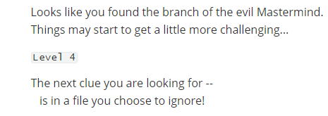

# git-game 通关记录

- [Level 1](#Level 1)
- [Level 2](#Level 2)
- [Level 3](#Level 3)
- [Level 4](#Level 4)
- [Level 5](#Level 5)
- [Level 6](#Level 6)
- [Level 7](#Level 7)
- [Level 8](#Level 8)
- [Level 9](#Level 9)
- [Level 10 - 最后一关](#Level 10)

## Level 1
这关要求我们解密然后跳到和答案同名的分支上。答案是Hello World

**线索**

**通关后**

**使用的命令**

```
git log
git checkout 6402
```

---------------
## Level 2
这关同样是解密然后跳到对应同名的分支上，答案是bug

**线索**

**通关后**

**使用的命令**git

```
git checkout bug
```

-------------------
## Level 3
这关让我们找到在cool.cpp中造成bug的人，然后跳到和该人名字同名的分支上。

**线索**

**通关后**


**使用的命令**
```
git blame cool.cpp
git checkout LinusTorvalds2014
```
**命令截图**


---------------
## Level 4
这关让我们到.gitignore文件找到下一关的提示。

**先手**

**通关后**

**使用的命令**

```
vi .gitignore

```

--------------
## Level 5
这关问实现set和map的底层数据结构是什么，找到后跳到同名的分支上，答案是tree。

**线索**

**通关后**


**使用的命令**
```
git checkout tree
```
**命令截图**


----------------
## Level 6
这一关让我们在git bash 中使用 ./outputclue.sh FILE 命令将nextclude_input.cpp 传入outputclue.sh程序中

**线索**

**通关后**


--------------
## Level 7
这一关让我们将分支 tree 和分支code4life 进行合并，并且解决冲突，在解决冲突之后再次运行./outputclue.sh FILE 命令将nextclude_input.cpp 传入outputclue.sh程序中。

**线索**

**通关后**


**使用的命令**
```
git merge origin/code4life
git status
git add --all
git commit -m "fix conflict"
./outputclue.sh nextclue_input.cpp
```
**命令截图**


---------------
## Level 8
这关要我们将当前分支工作目录下的Remeber文件和其他分支上的进行比较，从中可以获得下一关的线索。
**线索**


**通关后**


**使用的命令**
```
git checkout mouse
git branch
git diff bug remember
git checkout Henry
```
**命令截图**


-------------
## Level 9
在本关介绍了当前有一个tag和一个branch 的名称相同，要求我们切换到分支Henry上。
**线索**


**通关后**


**使用的命令**
```
//方法一 直接切换到分支
git checkout refs/remotes/origin/Henry
//方法二 将重名tag改名之后再跳转到Henry上
git tag HenryTag
git tag -d Henry
git checkout Henry
```

------------------
## Level 10
本关要求我们通过另外一个仓库来更新，master 分支的内容。新的仓库地址为https://github.com/drami025/git-game.git

**线索**


**通关后**


**使用的命令**
```
git remote add origin2
git checkout master
git remote -v
git pull origin2 master
```
** 命令截图**


