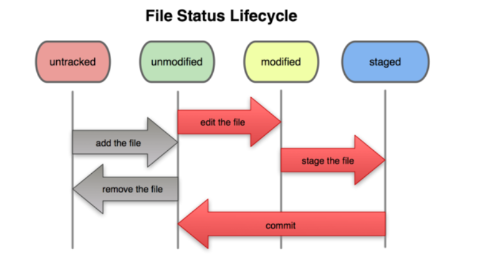
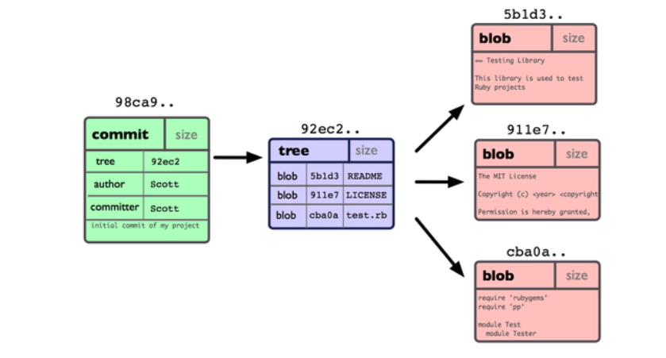
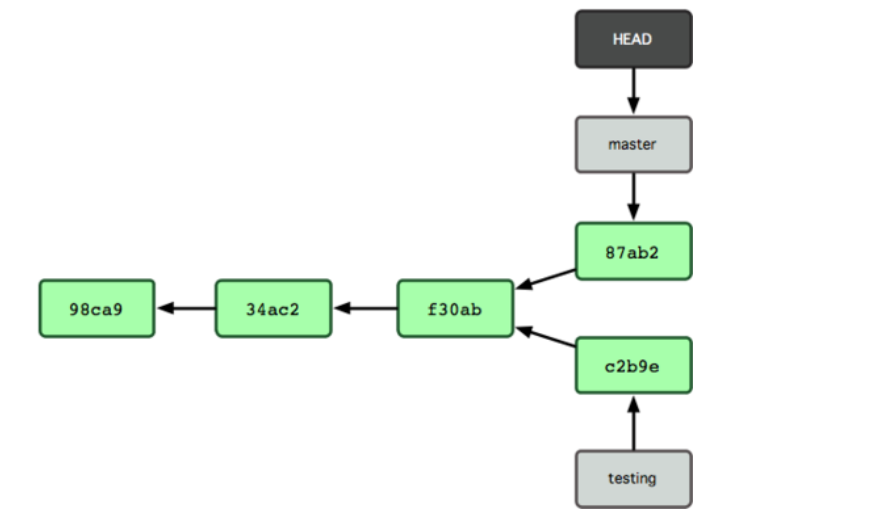
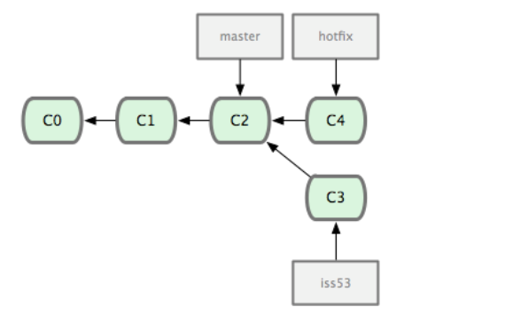
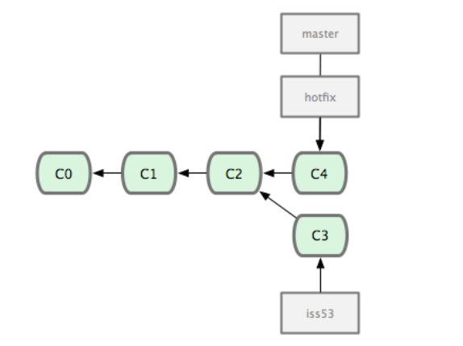
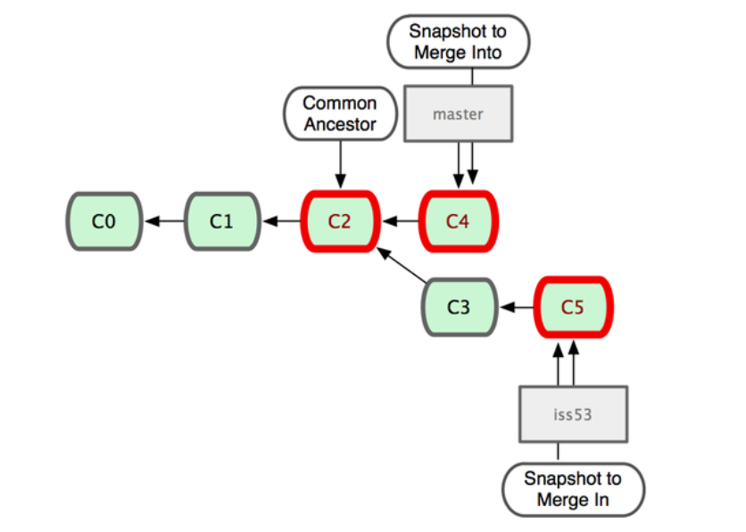
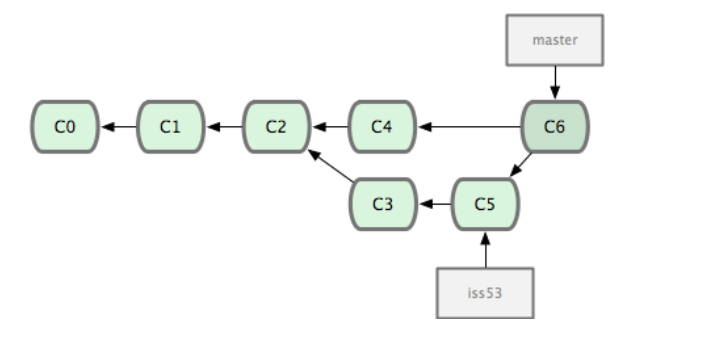
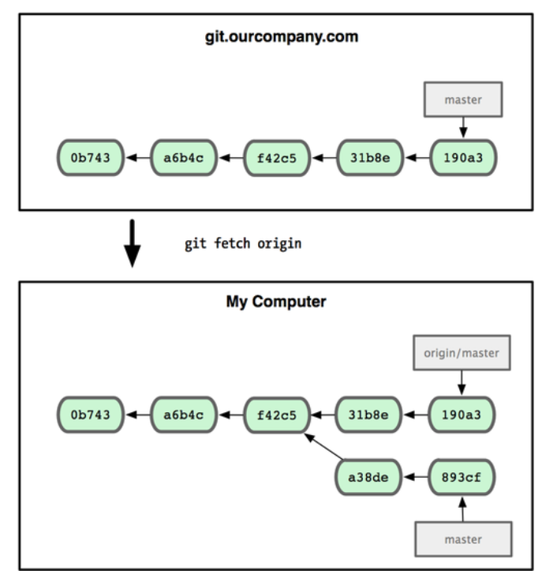
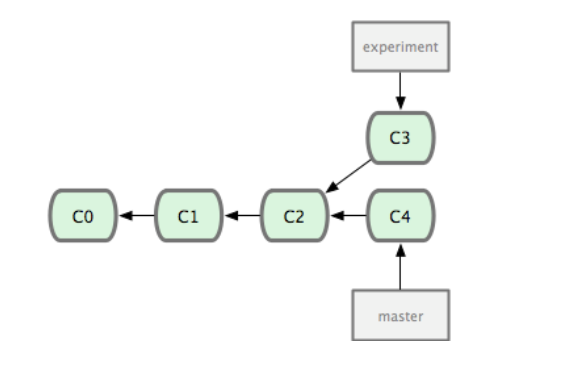
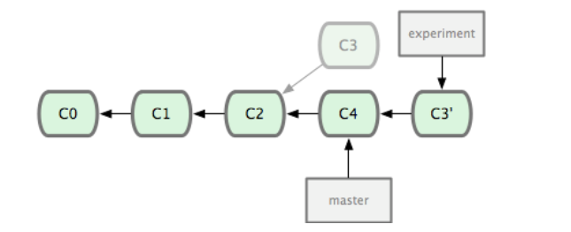

# LearnGit
通过模拟一个小项目来学习git

## 常用指令
```
git add -a 
git commit -m ""
git checkout <分支名>
git checkout -- .
git checkout -- <文件名>
git merge <分支名>
git revert <commitID>
git rebase <分支名>
git reset <commit ID>
git reset --hard HEAD
git branch <分支名>
git branch -f <分支名> <commit ID>
git push <版本库名> <分支名>
git push origin HEAD --force
git pull <版本库名> <分支名>
git pull --rebase <版本库名> <分支名>
git log --graph
```


## git中的文件状态
git管理的项目中的文件分为两种类型，**已追踪**和**未追踪**，而已追踪的文件的文件状态又分为 **未修改**，**已修改**，**已暂存** 三种。如下图所受。


## git 的管理方式
当我们使用git创建一个提交的时候，git会根据当前工作目录上的数据，为每一个目录创建一个Tree对象（每一个Tree都保存有该目录下的文件信息），然后为每一个文件创建一个Blob对象(每一个Blob都保存一个文件的快照)，最后再创建一个Commit对象(Commit对象都保存有根目录的Tree对象指针)，如下所示。



当我们提交了一个修改，创建一个commit对象的时候，这个commit对象就会指向前一个commit对象，这些commit对象会形成一条链表，如下图所示。


## git 中的分支
git 中的分支其实就是一个指针，创建分支实质上就是创建一个指向一个特定的commit对象的指针，而Head实质上就是一个指向当前工作目录所对应的分支的指针。如下图所示。


## git 中分支的合并
git中的合并有两种，一种是**fast forward** ，一种是**Automatic **。**fast foward**就是简单的指针移动，它发生的条件是两个要互相合并的分支互为祖孙关系。如下所示。

合并后


git 中**Automatic **的合并根据当前需要进行合并的两个分支所对应的commit对象，和他们的共同祖先的commit对象，三者所拥有的快照信息，来进行合并的。如下图所示。

合并后的新的commit对象指向两个父节点     


## 远程分支
远程分支（remote branch）是对远程仓库中的分支的索引。它们是一些无法移动的本地分支；只有在 Git 进行网络交互时才会更新。远程分支就像是书签，提醒着你上次连接远程仓库时上面各分支的位置。
当我们首次fetch，pull一个服务器上的分支的时候，本地就会创建一个远程分支和一个追踪分支。当我们clone一个仓库的时候，就会为远程库中的所有分支创建远程分支和对应的追踪分支。这些远程分支的命名默认为 <远程版本库名>/<远程分支名>，而追踪分支的名称默认为<远程分支名>。当我们从服务器中或者远程分支拉取数据的时候，本地的远程分支也会进行移动。如下图所示。


## revert 和reset 操作
revert 操作会提交一个新的commit 来进行一个回退，而reset操作则会直接回退到对应的commit的对象上。
在服务上使用revert来回退操作，和使用force push的方式的差别在于，使用force push 的方式可能会将其他做的修改给覆盖掉。而revert则不会放生这种情况。


## rebase 操作
衍合的目的，是想要得到一个能在远程分支上干净应用的补丁。
它的原理是回到两个分支最近的共同祖先，根据当前分支（也就是要进行衍合的分支 experiment）后续的历次提交对象（这里只有一个 C3），生成一系列文件补丁，然后以基底分支（也就是主干分支 master）最后一个提交对象（C4）为新的出发点，逐个应用之前准备好的补丁文件，最后会生成一个新的合并提交对象（C3'），从而改写 experiment 的提交历史，使它成为 master 分支的直接下游。如下图所示。


衍合后，注意此时指针的所指的位置



## git 中冲突的产生
- 在合并分支的时候发生。
- 从服务器拉取分支数据的时候发生。

----------------------
## 一些基本命令

### 将修改添加到暂存区中
```
git add <需要添加修改到暂存区的文件名>  --将一个文件的修改添加到暂存区

git add . --该命令会将工作区中的所有变换都添加到暂存区中，包括内容修改和追踪新创建的文件。但是不会添加文件的删除到暂存区中。

git add -u 该命令只添加已经被Git追踪的文件到暂存区中。所以它无法添加新创建的文件到暂存区中。

git add -a 该命令将所有已追踪和未追踪的文件的修改添加到暂存区中。
```

### 查看文件的修改
```
git diff  :查看工作区的文件和暂存区中的文件的差别。

git diff --cached 或者 git diff --stage  :查看暂存区中的文件和上次提交的文件的差异。

```

### 提交修改到本地的版本库中

```
git commit :将暂存区中的修改提交到版本库中，git命令行会打开一个编辑器来让你输入提交信息。

git commit -v :将暂存区中的修改提交到版本库中，git命令行会打开一个编辑器来让你输入提交信息。并且在编辑器中显示出文件的差异。

git commit -m <提交信息>  :将暂存区中的修改提交到版本库中,并让你在后面填入提交信息

git commit -a -m  :git commit 加上 -a 选项，Git 就会自动把所有已经跟踪过的文件暂存起来一并提交。

git commit --amend : 修改当前分支的最后一次提交，可以用来修改最后的提交信息，或者是为最后一次提交添加一些内容
```

### 删除文件
```
git rm <文件名> :删除工作目录中的指定文件，并且取消Git对该文件的追踪.会产生一个修改.

git rm -f <文件名> :如果删除之前修改过并且已经放到暂存区域的话，则必须要用强制删除选项 -f（译注：即 force 的首字母），以防误删除文件后丢失修改的内容。

git rm --cached <文件名> :不删除文件，只取消Git对该文件的追踪。当该文件的修改
```

### 查看提交历史
```
git log :显示所有的提交历史。

git log -p -<要查看的最近的提交数据> :-p 选项展开显示每次提交的内容差异，用 -2 则仅显示最近的两次更新。

git log --stat :stat，仅显示简要的增改行数统计

git log --pretty=oneline :将提交历史简化成一行显示。

git log --graph :以一种图形化的方式来显示提交历史。

git log --pretty=format:"<格式占位符> - <格式占位符>, <格式占位符> : <格式占位符>" :自定义显示格式
一些常用的格式占位符如下所示
选项 说明
    %H 提交对象（commit）的完整哈希字串
    %h 提交对象的简短哈希字串
    %T 树对象（tree）的完整哈希字串
    %t 树对象的简短哈希字串
    %P 父对象（parent）的完整哈希字串
    %p 父对象的简短哈希字串
    %an 作者（author）的名字
    %ae 作者的电子邮件地址
    %ad 作者修订日期（可以用 -date= 选项定制格式）
    %ar 作者修订日期，按多久以前的方式显示
    %cn 提交者(committer)的名字
    %ce 提交者的电子邮件地址
    %cd 提交日期
    %cr 提交日期，按多久以前的方式显示
    %s 提交说明
```

### 撤销修改
```
git reset --hard HEAD ：撤销所有未提交的修改内容

git checkout HEAD <文件名> :撤销指定的未提交文件的修改内容

git reset HEAD <文件名> : 撤销指定文件修改的暂存。

git reset --hard <commit ID> : 将当前的分支回退到指定的commit，不会创建新的commit，并且该分支的修改会在暂存区中。

git reset <分支相对引用> :将当前的分支回退到指定的位置，由相对引用来指定回退的步数，不会创建新的commit。

git checkout -- <文件名> :撤销文件的修改

git revert <分支名> :撤销制定分支的最后一个修改，会创建一个新的commit，用来修改到前一个状态。

git revert <commitID> :撤销指定提交,会新创建一些提交来覆盖想要进行撤销的提交。

git checkout --ours <文件名>:当冲突发生时保留指定文件的本地版本。

git checkout --theirs <文件名> :当冲突发生时保留指定文件的远端版本。
```

### 对远端的操作

```
git remote show origin :查看远端版本库的信息，包括远程新增，删除的分支，url等等。

git remote rm <远程版本库名> ：删除一个远端版本库的链接

git remote add <自定义的远程版本库的名称> <url 远程版本库的地址> ：添加一个远端版本库

git fetch <远程版本库名称> : 从远端拉去数据，首次使用会创建一个远程分支，否则更新远程分支。

git pull <远程版本库名> <分支名> :从远端的分支拉取数据，并且进行快速合并。

git pull --rebase <远程版本库名> <分支名> : 从远端拉取分支数据，然后进行沿合

git push <远程版本库名> <分支名> :只上传对应代码，上传完后对远程分支和对应的追踪分支进行快速合并。

git push <远程版本库名> <元分支>:<目的地分支> :将本地任意一个分支推送到远程的任意一个分支上，然后进行快速合并。(从他们的公共节点开始处理)
```

### 标签相关的命令

```
git tag :查看本地的所有标签

git show <标签名> :查看一个特定标签

git tag <标签名> :创建一个普通标签

git tag -a <标签名> -m <附注信息> : 创建一个带有附注信息的标签。

git tag -a <标签名> <提交的ID> :为某个提交打上标签
```


### 分支相关命令
```
git checkout <提交的ID> :让Head指针指向指定的提交

git branch :查看本地分支信息

git branch <分支名> :创建一个分支

git switch <分支名> :切换到指定分支。

git branch -d <分支名> :删除指定本地分支。

git branch -r -D <远程库名>/<分支名> :删除本地的远程分支。

git push origin -d <分支名> : 删除服务器上的分支。

git branch -v : 查看本地每一个分支的最后一个提交对象。

git branch -l :查看本地分支

git branch -r :查看远程分支

git branch --merge : 查看和当前分支已经和哪些分支合并。(当前分支的直接上游)

git branch --no-merged :查看尚未和当前分支合并的分支。

git checkout -b <跟踪分支名> <远程名>/<分支名> :本地创建一个新的分支，并设置其为远程分支对应的追踪分支。

git branch -u <远程名>/<分支名> <跟踪分支名> :设置远程分支对应的追踪分支。

git branch -f <分支名> <相对引用/提交ID> : 强制让某个分支 移动/指向 某个特定的commit对象。
```

### 其他命令
```
git cherry-pick <commit ID> :将指定的commit对象的修改提交到当前分支，被指定的commit会被复制一份进行添加。

git rebase -i HEAD<相对引用> :重新调整当前HEAD指针所在位置之前的提交记录。可以重新调整顺序或者是丢弃某些提交。
```
-------------------


## 一些具体操作

### 如何创建本地分支和远程分支

```
//创建本地分支
git branch <分支名>
//创建远程分支,直接将本地分支推送到远程即可
git push origin <分支名>
```


### 如何删除本地分支和远程分支

```
//删除本地分支
git branch -d <分支名>

//删除远程分支
git push origin --d <分支名>
```

### git如何查看本地和远程版本库的分支信息
```
--查看本地版本库的分支信息
git branch 

--查看远程版本库的分支信息
git branch -a
```

### 如何更换远程版本库的地址
```
git remote rm <远程版本库名>
git remote add <自定义的远程版本库的名称> <url 远程版本库的地址>
```
### 当想要修改以前的某个提交的时候
```
//先用git rebase -i 调整提交的顺序，将要修改的提交放到最前。
//使用git commit --amend 修改改提交
//最后用git rebase -i 调整提交的顺序。

```
### 如何撤销已经推送到远程的提交
```
//先用 git reset --hard <commit> 进行本地分支的提交撤销
//再用 git push origin HEAD --force 强制推送到远程
```


